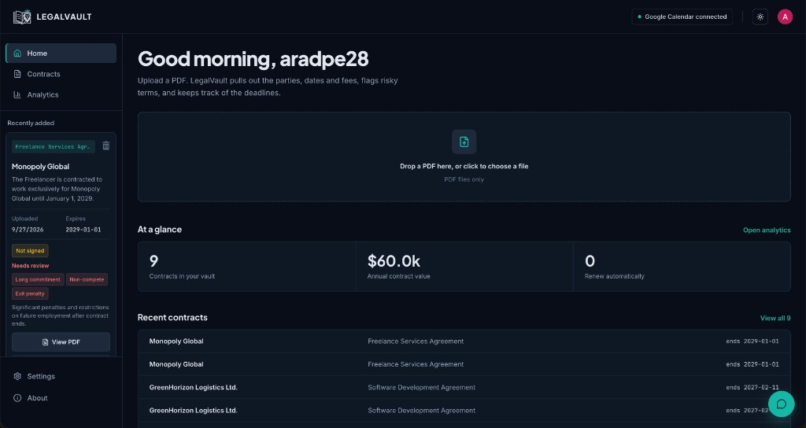
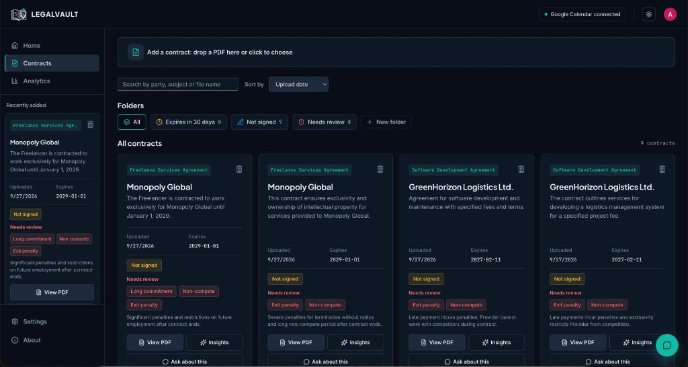
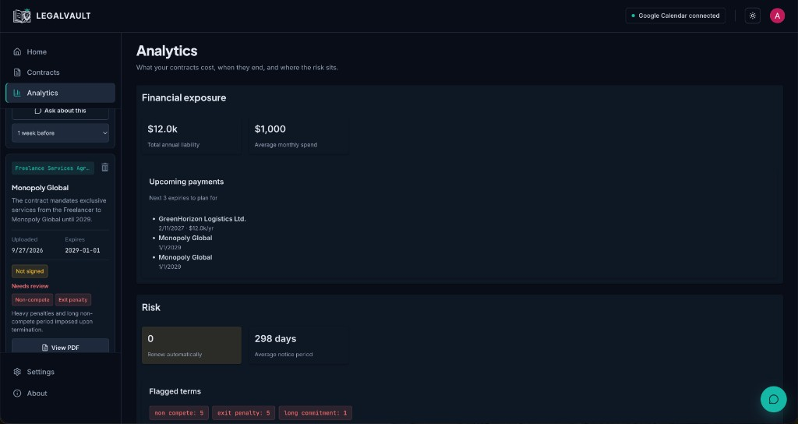
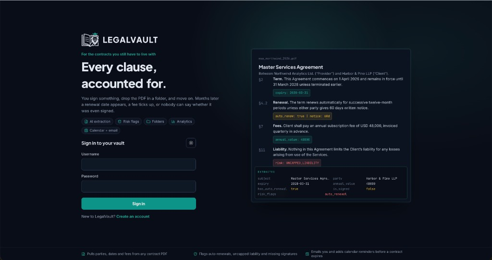
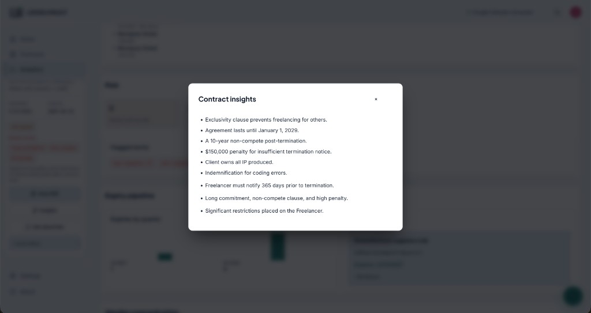
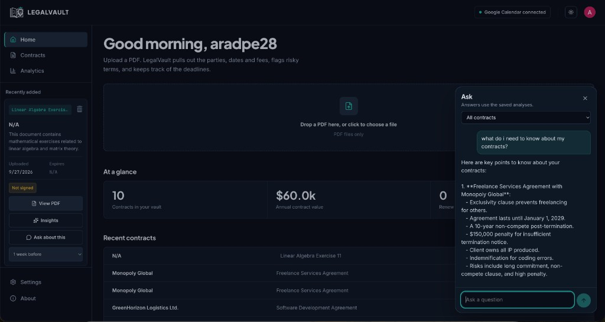

# LegalVault 2.0

LegalVault reads a contract PDF, pulls out the parties, dates, fees, and risky terms, and keeps the vault in one place. Version 2.0 adds a read-only chat over those saved analyses, a phone layout, and a public sign-up that does not wait on email verification.

Live app: [frontend-production-4e4c.up.railway.app](https://frontend-production-4e4c.up.railway.app)

## See it

| Home | Contracts | Analytics |
|------|-----------|-----------|
|  |  |  |

| Sign in | Contract insights | Ask |
|---------|-------------------|-----|
|  |  |  |

## What you see

### Home

After sign-in, Home greets you by name. The line under the greeting explains what an upload does, and the drop area spans the main column: drop a PDF or click to choose one. Under that, **At a glance** shows how many contracts are in the vault, the annual contract value, and how many renew automatically. **Recent contracts** lists the latest files, with a link to the full set.

The sidebar keeps Home, Contracts, and Analytics, a **Recently added** card, and Settings and About. The navbar shows whether Google Calendar is connected.

### Contracts

The Contracts page is the working list. A compact bar accepts another PDF. Search and sort sit under it, then folder chips: All, Expires in 30 days, Not signed, Needs review, and any folder you create.

Each card shows the subject, the other party, a short summary, upload and expiry dates, a Not signed mark when that applies, and the terms that need review. From the card you can open the PDF, open insights, or ask about that contract.

### Contract insights

Insights opens the saved analysis in a dialog: the clauses and dates the model pulled out, such as exclusivity, term, penalties, and notice. It reads the analysis already stored for that file. It does not upload the PDF again.

### Ask

The teal button at the bottom right opens **Ask**. A short label appears above the button, then fades. You can ask about every contract in the vault, or pick one. Answers use the saved analyses only. The chat cannot delete a contract, edit it, or change a reminder. On a phone the button sits in the bottom bar, and the chat opens as a full-height sheet.

### Analytics

Analytics summarizes the portfolio: total annual liability, average monthly spend, the next contracts to plan for, how many renew automatically, the average notice period, and how often each flagged term appears.

### Sign in

The public page is a split screen. The left side is the product line, “Every clause, accounted for.”, and the sign-in form. The right side is a specimen contract with the fields LegalVault extracts. Creating an account does not require a verification email. A username may be an email address, so browser autofill is accepted. On a phone, the logged-in app hides the sidebar and uses a bottom bar: Home, Contracts, Analytics, and More.

## Features

- **Analysis.** Upload a PDF. The app stores the file and returns parties, dates, fees, and risk flags from the text.
- **Ask.** Read-only questions over your own saved analyses, for the whole vault or one contract.
- **Insights.** The stored summary, opened from any contract card.
- **Folders.** Built-in filters plus folders you name yourself.
- **Google Calendar.** Connect an account and set a reminder for one week or one month before a date.
- **Sign-up.** Username, email, and password. No verification email. Usernames may contain `@` and dots.
- **Phone.** Below 760px the sidebar is replaced by a bottom bar, and insights and chat open as sheets.
- **Storage.** PDFs in S3. Accounts, analyses, and folders in DynamoDB. The browser keeps a JWT and signs out after a period of inactivity.

## Tech stack

| Layer | Technologies |
|-------|----------------|
| Frontend | React 19, TypeScript, Vite, React Router, Fluent UI, Axios |
| Backend | Python, FastAPI, Uvicorn, PyJWT, PyMuPDF |
| AI and data | OpenAI GPT-4o-mini, DynamoDB, S3 |
| Integrations | Google Calendar API, Google OAuth 2.0 |
| Hosting | Railway |

## Run it locally

```bash
git clone https://github.com/Aradperl/LegalVault.git
cd LegalVault
```

Backend:

```bash
cd backend
python3 -m venv venv
source venv/bin/activate   # Windows: venv\Scripts\activate
pip install -r requirements.txt
```

Create `backend/.env`:

```env
AWS_ACCESS_KEY_ID=...
AWS_SECRET_ACCESS_KEY=...
AWS_REGION=us-east-1
S3_BUCKET_NAME=...
OPENAI_API_KEY=...
JWT_SECRET=...
GOOGLE_CLIENT_ID=...
GOOGLE_CLIENT_SECRET=...
FRONTEND_URL=http://localhost:5173
```

AWS:

- DynamoDB tables `Users` (partition key `username`) and `Analyzed_Contracts` (partition `user_id`, sort `contract_id`). Folder schema is in `backend/FOLDERS_TABLE.md`.
- One S3 bucket for PDFs, with `PutObject`, `GetObject`, and presigned URL access.

Google Cloud:

- Enable the Google Calendar API.
- OAuth client type: Web application. Redirect URI: `http://localhost:8000/auth/callback`.
- Scope: `https://www.googleapis.com/auth/calendar.events`.

Two terminals:

```bash
cd backend && uvicorn main:app --reload
```

```bash
cd client && npm install && npm run dev
```

Backend: `http://127.0.0.1:8000`  
Frontend: `http://localhost:5173` (the API is `http://127.0.0.1:8000` unless `VITE_API_BASE` is set)

Python 3.9 can import the app. Railway runs a newer Python. Local sign-in only works while the API process is listening on port 8000.

## Layout

```
LegalVault/
├── backend/
│   ├── main.py
│   ├── config.py
│   ├── deps.py
│   ├── models.py
│   ├── routers/          # auth, contracts, folders, google_auth, chat
│   └── services/         # ai_service, auth_service, calendar_service
├── client/
│   └── src/
│       ├── App.tsx
│       ├── apiService.ts
│       ├── layouts/      # sidebar, and a bottom bar on a phone
│       ├── pages/        # Home, Contracts, Analytics, Settings, About
│       └── components/   # Navbar, ContractCard, ChatDock, upload bars
├── screenshots/
└── README.md
```

## API

| Area | Endpoints |
|------|-----------|
| Auth | `POST /signup`, `POST /login`. Other routes expect `Authorization: Bearer <token>`. |
| Contracts | `POST /contracts/upload`, `GET /contracts`, `GET /contracts/{id}`, `GET /view/{id}/pdf`, `DELETE /contracts/{id}` |
| Folders | `GET /folders`, `POST /folders`, `DELETE /folders/{id}` |
| Chat | `POST /chat` with a message, optional `contract_id`, and the thread so far |
| Google | `GET /auth/google`, `GET /auth/callback`, `GET /check-google-connection`, `POST /update-reminder` |

## Production

Do not commit `.env`.

The API refuses to start when `ENVIRONMENT=production` or `FRONTEND_URL` is not localhost and `JWT_SECRET` is missing or still the placeholder. CORS allows `FRONTEND_URL`, optional `CORS_ORIGINS`, localhost on port 5173, and `*.up.railway.app`. It does not allow `*`.

Signup checks the username (3–64 characters; letters, numbers, and `. _ % + - @`), a valid email, and a password of at least 10 characters with a letter and a number.

Railway backend variables:

| Variable | Value |
|----------|--------|
| `JWT_SECRET` | Long random secret |
| `FRONTEND_URL` | `https://frontend-production-4e4c.up.railway.app` |
| `ENVIRONMENT` | `production` |
| `S3_BUCKET_NAME` | The contracts bucket |
| `AWS_ACCESS_KEY_ID`, `AWS_SECRET_ACCESS_KEY`, `AWS_REGION` | IAM user for S3 and DynamoDB |
| `OPENAI_API_KEY` | Required for analysis and Ask |
| `CORS_ORIGINS` | Optional extra origins |
